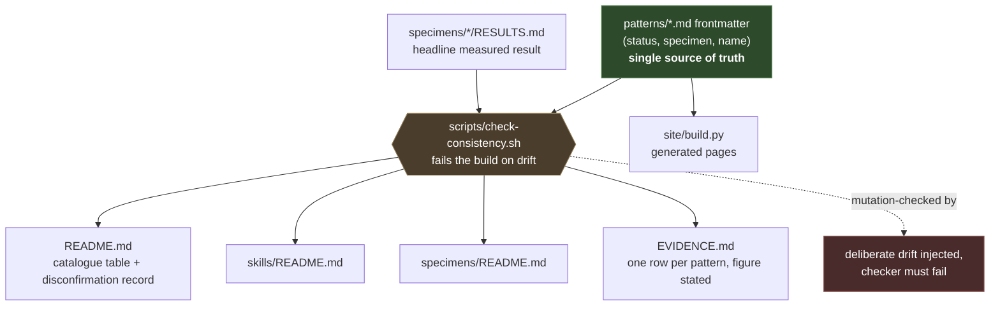
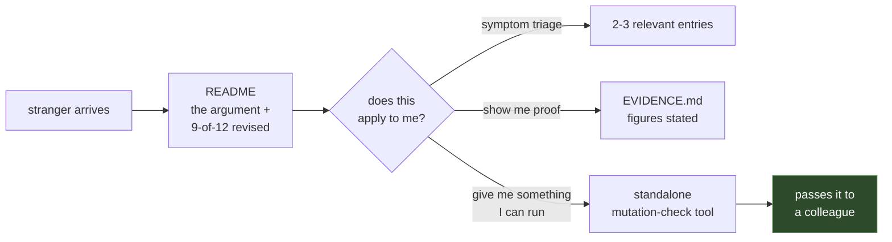

# Reposition the catalogue for an audience it can actually reach

## Overview

The catalogue is complete, correct, and effectively undiscoverable. Twelve patterns, twelve
specimens, every suite green, a static mirror with real metadata — and a title that sorts it into
the wrong field, evidence buried three levels deep, and no on-ramp for a reader who does not
already know what a pattern language is.

This plan changes none of the twelve claims. It changes what a stranger encounters first, adds the
one artifact that can travel on its own, and installs the guard that stops the repository's own
metadata from drifting again before it goes public.

**The stated goal is audience:** practitioners finding, reading, and citing this. Everything below
is subordinate to that.

## Problem Frame

The repository was built to be *correct*. It succeeds — `make test` and `make demo` are green
across all twelve specimens, `make site-check` passes, the CI design mutation-checks its own
scanner before trusting a clean run, and the method discipline is unusually rigorous for a
personal repository.

It was not built to be *found, understood in ninety seconds, or used*. Those are different problems
and only the first has been solved.

Four things stand between the current artifact and an audience:

1. **The title sorts it into the wrong field.** In this field "refusal" is a term of art for a
   model declining a user request. This repository means something else — a system refusing to
   trust a signal.
2. **The strongest evidence is at depth three.** The measured results live in
   `specimens/*/RESULTS.md`, which nobody opens.
3. **There is no on-ramp.** Twelve entries of roughly a thousand words each, no triage, no route
   from a symptom a reader recognises to the entry that addresses it.
4. **Nothing travels alone.** The skills require an agent harness. There is no single file a
   reader can run in a minute and pass to a colleague.

A fifth thing is disqualifying rather than limiting: **the repository's own status metadata has
drifted across three copies and disagrees with itself.** A catalogue arguing that the reassuring
signal is the one that is lying cannot ship with a status table that lies. This is not a polish
item; it is a precondition.

## Requirements Trace

- **R1.** A stranger who lands on the README understands what this is and whether it applies to
  them inside ninety seconds.
- **R2.** The disconfirmation record — nine of twelve entries revised by their own specimens — is
  visible above the fold, not in paragraph six.
- **R3.** The measured results are reachable in one click from the front page, with the headline
  figure stated rather than linked-to.
- **R4.** At least one artifact is standalone, dependency-free, and useful to someone who never
  reads a pattern.
- **R5.** Repository metadata is internally consistent and *stays* consistent, enforced rather
  than remembered.
- **R6.** Nothing in this plan weakens, widens, or narrows any of the twelve claims.
- **R7.** The publication discipline in `METHOD.md` survives every change, including the two
  gating rules in `CLAUDE.md`.

## Scope Boundaries

- **No thirteenth pattern.** The bound holds. Twelve, then finished.
- **No new skills.** The gate (a skill requires a pattern with a specimen) is not being revisited.
- **No re-running live probes.** They cost money and no claim in this plan depends on new
  measurement.
- **No rewriting of pattern bodies for prose quality.** Word-count trimming is out of scope except
  where the checker threshold is corrected to match the stated target.
- **No changes to any pattern's claim.** If a claim is wrong, that is a specimen's job to
  establish, not this plan's.
- **No abstraction, framework, or packaging of the specimens.** They remain reference
  implementations, explicitly unmaintained *as software*.

### Deferred to Separate Tasks

- **Trimming the nine patterns over the 950-word target** — a separate editing pass, once the
  checker reports against the real target. This plan fixes the threshold, not the prose.
- **Launch execution** (Show HN submission, timing, the post itself) — a separate task after this
  plan lands and the repository is public.
- **Adding falsification sections to specimens 04, 05 and 10** — genuine evidence gaps against the
  `CLAUDE.md` standard, but they require judgement about what would falsify each claim, which is
  the author's call and not a repositioning task.

## Context & Research

### Findings from the current repository

Verified by inspection, not assumed:

| Finding | Evidence |
|---|---|
| Status metadata exists in three copies and they disagree | `patterns/*.md` frontmatter: all twelve `field-tested`. `README.md:28-29`: 07 and 08 listed `draft`. `skills/README.md:21`: states pattern 05 is `draft` — it is not. |
| The published surface disagrees with the local index | `site/build.py` reads frontmatter, so the generated pages assert `field-tested` for 07 and 08 while `README.md` says `draft`. |
| Three specimens contradicted their pattern's central claim | `specimens/05-judge-family/RESULTS.md:56`, `specimens/07-over-refusal/RESULTS.md:34`, `specimens/08-remembered-is-not-current/RESULTS.md`. All three entries were honestly rewritten; the status vocabulary cannot express the outcome. |
| One broken relative link | `specimens/01-grounded-or-refuse/README.md` → `patterns/05-judge-cannot-share-family.md` (missing `-a-`). |
| A documented `make` target does not exist | `specimens/README.md:24` references `make dev`; `Makefile` has no such target. |
| The word-count checker is more lenient than the stated rule | `Makefile:83` flags `> 1000`; the house target in `CLAUDE.md` and `Makefile:80` is 650–950. Nine of twelve patterns exceed 950; the checker flags four. |
| `specimen:` frontmatter format is inconsistent | `patterns/01-*.md` uses `01`; all others use the directory slug. Published pages render both forms. Nothing validates that the referenced directory exists. |
| Everything else is sound | `make test`, `make demo` green across all twelve; `make site-check` passes; mutation-check records present in all twelve specimen READMEs. |

### External references

Numbers below are **external and attributed**. Per `CLAUDE.md` rule 2 they may inform this plan but
must not migrate into `patterns/` or `specimens/` as unattributed repository claims.

- [12-factor-agents](https://github.com/humanlayer/12-factor-agents) — the closest structural
  comparable: also twelve, also bounded, also markdown-per-entry, 25.1k stars. Differs in that its
  entry titles are imperative and self-explaining, and it is bounded-but-alive (273 commits,
  invites contribution) rather than declared unmaintained.
- [Its Hacker News thread](https://news.ycombinator.com/item?id=43699271) — the single most common
  criticism was the absence of concrete demonstration: *"pick a real-world agent workflow... and
  showcase how all these factors will come along."* This is precisely the gap twelve runnable
  specimens fill, and it is the strongest available differentiator.
- [Hamel Husain's evals FAQ](https://hamel.dev/blog/posts/evals-faq/) — the canonical practitioner
  resource on LLM evaluation, companion to a course taught to
  [4,500+ students from 500+ companies](https://maven.com/parlance-labs/evals). Fetched and
  checked: it covers criteria drift, annotation process and synthetic-data limits. It does **not**
  cover judge bias mechanisms, mutation-testing the tests, or validating that a passing test means
  anything — patterns 05, 11 and 01 respectively.
- Refusal terminology — [refusal mechanism](https://www.emergentmind.com/topics/refusal-mechanism),
  [RefusalBench](https://www.emergentmind.com/topics/refusalbench),
  [over-refusal / exaggerated safety](https://arxiv.org/pdf/2508.11222). Confirms the collision:
  the term denotes a model declining a user request, not a system declining to trust a signal. Only
  pattern 07 concerns refusal in the field's sense.
- Judge bias is heavily researched but not operationalised —
  [self-preference bias](https://arxiv.org/pdf/2410.21819),
  [position bias in rubric-based judging](https://arxiv.org/pdf/2602.02219). Papers, not tools an
  engineer drops into a pipeline.
- The thesis is being asserted in the market without evidence behind it — a 2026 guardrails guide
  states *"a content filter that has never been probed with real injection techniques is security
  theater"* ([source](https://generalanalysis.com/guides/best-ai-guardrails)). That is patterns 04
  and 11, asserted. This repository measured them.

### The position this establishes

Between the papers, which measure but ship nothing, and the practitioner writing, which ships
advice but skips these failure modes. No other artifact was found occupying it.

## Key Technical Decisions

- **Rename the repository for the problem; keep "The Refusal" as the response.** The twelve
  `## The Refusal` sections stay verbatim. The repository is named for the false signal; each entry
  is named for what you do about it. This is what makes the rename cheap — no section rewrites.
- **`not-evidence` as the new name.** "Green is not evidence" is already the strongest sentence in
  the repository and is pattern 11's title. The repository generalises it. Three words tell a
  stranger what they are looking at. Reversible: GitHub preserves redirects on rename, and the
  change touches `README.md`, `site/build.py` and the directory name only.
- **Frontmatter is the single source of truth for status.** Every other copy — `README.md`,
  `skills/README.md`, `specimens/README.md`, the generated site — is derived or checked, never
  hand-maintained in parallel. Three hand-maintained copies is what produced the drift.
- **Extend the status vocabulary to four terms.** `draft | field-tested | revised-by-specimen |
  superseded-by: NN`. The existing three cannot express what happened nine times: measured, the
  original claim did not survive, the entry was rewritten to what held. `field-tested` reads as
  confirmation and over-claims for 05, 07 and 08. Making this legible converts the repository's
  most differentiating property from buried prose into visible metadata.
- **The consistency checker is itself mutation-checked.** A checker that passes vacuously is the
  exact failure this repository is about. Non-negotiable, and it follows the precedent already set
  by the CI canary in `.github/workflows/`.
- **Pattern 11 is the wedge.** Broadest applicability — any test suite, not only LLM systems —
  sharpest measured result, and no dependency on a model or a key. It is the one idea that can
  travel to someone who never reads a pattern.
- **Drop "explicitly unmaintained" as a repository-level posture; keep it for the specimens.**
  Bounded-in-scope and frozen are different claims. The comparable is bounded and visibly alive. A
  stranger reads "unmaintained" as abandoned and leaves.

## Open Questions

### Resolved during planning

- *Reach or career artifact?* — Reach, confirmed by the author. The work required for a career
  artifact is a strict subset, so no path is foreclosed.
- *How far to take the rename?* — Reposition the repository and README; leave the twelve
  `## The Refusal` sections untouched. Full removal of the word was considered and rejected as an
  expensive rewrite for marginal additional clarity.
- *Which pattern is the wedge?* — 11. See decisions above.
- *Which status is correct for 05, 07 and 08?* — Neither of the two existing answers. The
  vocabulary was the problem, not the assignment.

### Deferred to implementation

- **Exact mutation operators for the standalone tool.** Determined by what actually kills tests in
  the twelve existing suites; discoverable only by running it against them.
- **Whether the triage on-ramp lives in `README.md` or its own file.** Depends on the README's
  length after rewrite. If the rewritten README stays under roughly 150 lines, inline it.
- **Whether `EVIDENCE.md` is generated or hand-written.** Generation is preferable and consistent
  with the frontmatter-as-truth decision, but only if the headline figures can be extracted from
  `RESULTS.md` without brittle parsing. Falls back to hand-written with a checker that verifies
  every pattern has a row.
- **The one-sentence pitch.** Needs the rewritten README to exist before it can be compressed out
  of it.

## High-Level Technical Design

> *This illustrates the intended approach and is directional guidance for review, not
> implementation specification. The implementing agent should treat it as context, not code to
> reproduce.*

The metadata problem and the discoverability problem share a root: facts about the catalogue are
currently restated by hand in four places. The fix is one direction of flow, with a checker at
every derived surface.

Reader entry becomes a funnel with a triage step, rather than twelve equal doors:

## Implementation Units

- [ ] **Unit 1: Consistency checker, mutation-checked, wired into `make check`**

**Goal:** Make frontmatter the enforced single source of truth, so that every subsequent unit in
this plan edits derived surfaces without being able to reintroduce drift.

**Requirements:** R5, R7

**Dependencies:** None. This lands first because every later unit edits the files it guards.

**Files:**
- Create: `scripts/check-consistency.sh`
- Create: `scripts/test_check_consistency.sh` (mutation harness)
- Modify: `Makefile` (add `consistency` target; add to `check`; correct `words` threshold to 950)
- Modify: `.pre-commit-config.yaml` (add as a local hook)
- Modify: `.github/workflows/` (add to CI, matching the existing canary precedent)

**Approach:**
- Parse `patterns/*.md` frontmatter for `pattern`, `name`, `status`, `specimen`.
- Assert, and fail loudly on any of: a `README.md` table row whose status differs from frontmatter;
  a `skills/*/SKILL.md` whose `status` exceeds its pattern's; a `skills/README.md` row disagreeing
  with the skill's own frontmatter; a `specimen:` value that does not resolve to a directory under
  `specimens/`; a `specimen:` value not matching the directory-slug convention; any relative
  markdown link that does not resolve; a `make` target referenced in prose that the `Makefile` does
  not define.
- Emit the drift as a diff, not a boolean. A checker that says "failed" without saying what is the
  thing people learn to bypass — the same reasoning as `scripts/review.sh` being advisory.
- Correct `Makefile:83` to flag against 950, matching the stated target. Expect nine patterns to
  start flagging; that is the correct signal, and trimming them is explicitly deferred.

**Execution note:** Test-first. Write the mutation harness before the checker, so the checker's
first run is against a tree with drift deliberately present.

**Patterns to follow:**
- `.github/workflows/` canary block — plant a known-bad input, require the tool to catch it before
  trusting a clean result on the real tree.
- `scripts/scan-tree.sh` for the blocking-script shape; `scripts/review.sh` for advisory output.

**Test scenarios:**
- *Happy path:* checker run against the tree after Unit 2–6 land → exits 0, reports every surface
  checked.
- *Happy path:* checker run against the tree **as it is today** → exits non-zero and names the four
  known drifts (07/08 status, skills/README pattern-05 claim, broken 01→05 link, `make dev`).
- *Mutation:* flip one pattern's frontmatter `status` without touching `README.md` → checker fails,
  naming the pattern and both values.
- *Mutation:* set a skill's `status` to `field-tested` while its pattern is `draft` → fails on the
  cannot-claim-more-than-its-pattern rule.
- *Mutation:* point a `specimen:` key at a directory that does not exist → fails.
- *Mutation:* break one relative link in any markdown file → fails, naming file and target.
- *Mutation:* reference a nonexistent `make` target in prose → fails.
- *Edge case:* a pattern with `superseded-by: NN` set → checker resolves the target and does not
  demand a `README.md` status match, since deprecated entries move out of the table.
- *Edge case:* empty or malformed frontmatter → fails with a parse error, never silently passes.
- *Error path:* run from outside the repository root → fails with a clear message rather than
  reporting a clean tree.
- *Integration:* `make check` fails when any of the above holds; pre-commit blocks the commit; CI
  blocks the push.

**Verification:**
- Every mutation above is recorded with how many assertions it broke, in the same table form the
  specimen READMEs use.
- `make check` is red on the current tree and green after Unit 5.
- No mutation survives unexplained; any that does is documented with why the checker is insensitive
  to it by construction, following the precedent in `specimens/06-unratified-weights/README.md`.

---

- [ ] **Unit 2: Fourth status term, and correct the three drifted copies**

**Goal:** Give the vocabulary a term for the outcome that occurred nine times, and bring every copy
of the status metadata into agreement.

**Requirements:** R2, R5, R6

**Dependencies:** Unit 1 (the checker must exist to verify the result, and must learn the new term).

**Files:**
- Modify: `patterns/*.md` (frontmatter `status` for 05, 07, 08; the vocabulary comment on all twelve)
- Modify: `patterns/01-grounded-or-refuse.md` (`specimen: 01` → directory slug)
- Modify: `README.md` (status column, vocabulary line at `README.md:65`)
- Modify: `skills/README.md` (the pattern-05 claim at line 21; status column)
- Modify: `specimens/README.md` (remove the `make dev` reference)
- Modify: `specimens/01-grounded-or-refuse/README.md` (broken link)
- Modify: `CLAUDE.md`, `METHOD.md` (status vocabulary definition)
- Modify: `site/build.py` (render the new term with its one-line meaning)

**Approach:**
- Add `revised-by-specimen` to the vocabulary, defined as: *a specimen measured this claim, the
  original did not survive, and the entry states what did.*
- Apply to 05, 07 and 08 — the three where `RESULTS.md` records the central claim not reproducing.
- Leave the other nine as `field-tested`. Note in `CLAUDE.md` that the README's "nine of twelve were
  revised" counts a broader set (entries narrowed by evidence) than the three whose *central* claim
  failed; if that number cannot be reconstructed from the specimens, weaken it to what can.
- On the published pages, the new status carries a sentence explaining it, so a stranger reads it as
  rigour rather than as a warning.

**Execution note:** The claim in `README.md` that nine entries were revised should be verified
against the twelve `RESULTS.md` files before it survives the rewrite in Unit 3. A repository about
unverified assurances must not ship an uncounted count.

**Patterns to follow:**
- The status block in every `patterns/*.md` frontmatter.
- `deprecated/README.md` for how a status change is described without narrating history in the entry.

**Test scenarios:**
- *Integration:* `scripts/check-consistency.sh` passes across all twelve patterns, five skills and
  three README tables.
- *Happy path:* `make site-check` passes; generated pages for 05, 07 and 08 render
  `revised-by-specimen` with its explanatory sentence.
- *Edge case:* the checker rejects a status value outside the four-term vocabulary.
- *Integration:* every internal link still resolves after the pattern-01 `specimen:` key change.

**Verification:**
- Three copies of the status metadata agree, and the checker proves it rather than a human
  confirming it.
- The site republishes with no status differing from frontmatter.

---

- [ ] **Unit 3: Rename, and rewrite the README as an argument**

**Goal:** A stranger understands what this is, whether it applies to them, and why they should
believe it — inside ninety seconds.

**Requirements:** R1, R2, R6

**Dependencies:** Unit 2 (the status column must be correct before it is featured).

**Files:**
- Modify: `README.md` (substantial rewrite)
- Modify: `site/build.py` (index title, OG defaults, canonical base)
- Modify: `CLAUDE.md` (the "What this is" section)
- Rename: repository and working directory → `not-evidence`

**Approach:**
- Retitle around the through-line. The twelve `## The Refusal` sections are **not** touched — the
  repository is named for the false signal, each entry for the response to it.
- Restructure the README in this order: the argument in two sentences → the disconfirmation record
  → the evidence table → the triage on-ramp → the catalogue table → method → licence. The catalogue
  table currently sits first and is the least useful thing to a stranger.
- Lead the disconfirmation record. It is the property nothing else in this space has and it is
  currently in paragraph six.
- Rewrite the "Who wrote this" section to point at `METHOD.md` as content rather than as a
  disclaimer. For an audience of senior people in regulated industries who default to silence, a
  working discipline for publishing safely is more differentiating than any single pattern.
- Replace the repository-level "explicitly unmaintained" with a bounded-but-alive posture. Keep the
  unmaintained claim scoped to the specimens as software, which is where it is true and useful.
- Preserve every employer disclaimer verbatim. This is not a place for compression.

**Execution note:** The rename is reversible — GitHub preserves redirects — but the README rewrite
is the highest-leverage change in this plan. Draft it, leave it a day, reread it cold as someone
who has never seen the repository.

**Patterns to follow:**
- [12-factor-agents](https://github.com/humanlayer/12-factor-agents) for entry-title voice: imperative
  and self-explaining rather than aphoristic. Applies to how entries are *listed* in the README
  table, not to renaming the patterns themselves.
- The existing README's own prose register — it is good. This is restructuring, not a rewrite of
  voice.

**Test scenarios:**
- *Integration:* `scripts/check-consistency.sh` passes after the rewrite — every table row still
  matches frontmatter, every link still resolves.
- *Happy path:* `make site-check` passes; the index page carries the new title, description and
  canonical URL.
- *Edge case:* every relative link in `README.md` resolves after the directory rename.
- *Edge case:* `scripts/assert-identity.sh` and both scanners still run clean from the renamed
  directory (no hard-coded path assumptions).
- *Integration:* the employer disclaimer is present and unmodified — assert this in the checker, so
  no future edit can quietly drop it.

**Verification:**
- A reader who has never seen the repository can state, after ninety seconds, what it claims and
  what would make it wrong.
- The phrase "nine of twelve" appears above the catalogue table.

---

- [ ] **Unit 4: `EVIDENCE.md` — the measured results, stated**

**Goal:** Put the figures on the front page. They are the reason to believe any of this and they
are currently three levels deep.

**Requirements:** R3, R6

**Dependencies:** Unit 1 (the checker verifies completeness), Unit 2 (statuses must be correct).

**Files:**
- Create: `EVIDENCE.md`
- Modify: `README.md` (link prominently)
- Modify: `scripts/check-consistency.sh` (assert one row per pattern)
- Modify: `site/build.py` (emit as a page)

**Approach:**
- One row per pattern: the claim in one line, the headline measured figure, the scope in a clause,
  and a link to the `RESULTS.md` that carries the working.
- State the figure. Do not link to it. The whole point is that "40.6% of the simplex flipped a real
  scorecard" is legible where "see RESULTS.md" is not.
- Mark the three `revised-by-specimen` rows explicitly with what did not reproduce. Those rows are
  the most credible thing on the page, not an embarrassment to soften.
- Every figure must already exist in a `specimens/*/RESULTS.md` in this repository. This file
  aggregates; it never computes, and it never introduces a number that was not generated here
  (`CLAUDE.md` rule 2).
- Prefer generating it from `RESULTS.md` if the headline figures can be extracted without brittle
  parsing; otherwise hand-write it and have the checker assert completeness and link resolution.

**Test scenarios:**
- *Happy path:* every one of the twelve patterns has exactly one row.
- *Integration:* every figure in `EVIDENCE.md` appears verbatim in the `RESULTS.md` it cites —
  asserted by the checker, so the aggregate cannot drift from the source.
- *Edge case:* a pattern whose specimen produced a null result renders as a null result, not as a
  blank cell.
- *Error path:* a row citing a `RESULTS.md` path that does not exist → checker fails.
- *Mutation:* alter a figure in `EVIDENCE.md` so it no longer matches its source → checker fails.
- *Mutation:* delete a row → checker fails on completeness.

**Verification:**
- No figure appears in `EVIDENCE.md` that is not traceable to a specimen in this repository.
- The checker fails if any row and its source disagree.

---

- [ ] **Unit 5: The triage on-ramp**

**Goal:** Route a reader from a symptom they recognise to the two or three entries that address it,
so they never have to read twelve thousand words to find out whether this is for them.

**Requirements:** R1, R6

**Dependencies:** Unit 3 (its home depends on the rewritten README's length).

**Files:**
- Modify: `README.md` (inline if the README stays under roughly 150 lines)
- Create: `START-HERE.md` (only if it does not fit inline)
- Modify: `scripts/check-consistency.sh` (assert every pattern is reachable from the triage)

**Approach:**
- Organise by symptom, in the reader's words, not by pattern number. *"My eval suite is green and
  I don't know what that proves"* → 11, 01. *"A model is grading another model and the score gates
  a release"* → 05, 06. *"We shipped image input last month"* → 09, 04. *"Someone handed me a file
  marked sanitised"* → 12. *"My agent quoted a number it had seen earlier"* → 08.
- Every pattern must be reachable from at least one symptom. A pattern no reader can arrive at
  through a symptom they recognise is a signal the entry is a description rather than a pattern —
  worth noting, not worth fixing in this plan.
- Keep it to a table. This is a router, not an essay.

**Patterns to follow:**
- The `refuses:` frontmatter field already states each pattern's function in one clause. It is most
  of the raw material.

**Test scenarios:**
- *Happy path:* every one of the twelve patterns appears under at least one symptom.
- *Integration:* checker asserts reachability, so a future pattern edit cannot orphan an entry.
- *Edge case:* a symptom mapping to a `revised-by-specimen` pattern routes to the current narrowed
  claim, not the original.
- *Error path:* a symptom row linking to a nonexistent anchor → checker fails.

**Verification:**
- Twelve patterns, twelve reachable, asserted rather than eyeballed.

---

- [ ] **Unit 6: The standalone mutation-check tool**

**Goal:** One file, no dependencies, useful in sixty seconds to someone who never reads a pattern.
This is the artifact that can travel on its own.

**Requirements:** R4, R6

**Dependencies:** None on the other units — can be built in parallel with Units 2–5.

**Files:**
- Create: `tools/mutcheck.py` (single file, standard library only)
- Create: `tools/test_mutcheck.py`
- Create: `tools/README.md`
- Modify: `README.md`, `EVIDENCE.md` (link from the wedge pattern)
- Modify: `Makefile` (include in `test`)

**Approach:**
- `python3 mutcheck.py <test_file> <subject_file>` — applies a small set of mutation operators to
  the subject, runs the tests, reports which mutations survived.
- Standard library only, no configuration, no plugin system, single file. Every one of those
  constraints is what makes it copyable, and `CLAUDE.md`'s simplicity rules apply with full force:
  if it exceeds roughly 200 lines, it is doing too much.
- This is **not** a general-purpose mutation testing framework — those exist and are better. It is
  the smallest thing that demonstrates pattern 11 on a reader's own suite. Say so in
  `tools/README.md`, prominently, and name the mature alternatives.
- Validate against the twelve existing specimen suites, whose mutation results are already recorded
  in their READMEs. That is a real regression corpus and it is already in the repository.
- Ship its own mutation record, in the same table form the specimens use. A mutation-check tool that
  is not mutation-checked is the joke this repository exists to prevent.

**Execution note:** Test-first, and mutation-check the tool against itself before it is documented
as working.

**Patterns to follow:**
- `specimens/11-mutation-check/mutation.py` — the existing implementation is the reference. The
  standalone version is an extraction, not a redesign.
- `skills/mutation-check/SKILL.md` for the framing and the honest-limits section.

**Test scenarios:**
- *Happy path:* run against a suite with a known-weak test → the surviving mutation is reported.
- *Happy path:* run against a suite where every mutation is caught → reports a clean result and
  says how many operators ran, so a clean result is distinguishable from no operators running.
- *Edge case:* subject file with no mutable constructs → reports zero applicable mutations
  explicitly, never a misleading "all caught".
- *Edge case:* a test suite that is already failing before mutation → refuses to run and says why.
  A mutation score against a red suite is meaningless.
- *Edge case:* a mutation that causes an infinite loop → timeout, counted as caught, reported
  distinctly from an assertion failure.
- *Error path:* nonexistent file paths → clear error, non-zero exit.
- *Error path:* a test runner raising a non-assertion exception → counted as a failure, not a pass.
  This is the exact defect the mutation run found in
  `specimens/03-deterministic-over-prompted/README.md:122`.
- *Integration:* run against all twelve specimen suites; results reconcile with the mutation tables
  already recorded in their READMEs.
- *Mutation:* break the mutation applier so it produces no mutants → the tool must report zero
  operators, not a clean pass.
- *Mutation:* break the result reporter so survivors are dropped → its own tests fail.

**Verification:**
- Reproduces the recorded mutation results for at least three of the twelve specimen suites.
- A clean result and a no-op result are visually distinguishable in the output. This is the
  repository's whole thesis applied to its own tool.
- The tool's own mutation table ships in `tools/README.md`.

## System-Wide Impact

- **Interaction graph:** `scripts/check-consistency.sh` becomes a gate in three places — `make
  check`, pre-commit, and CI — mirroring the existing scanner topology. Every documentation unit in
  this plan is verified by it rather than by review.
- **Error propagation:** The checker must fail loudly and specifically. `CLAUDE.md` already records
  that a rule firing on prose trains people to bypass the hook; a checker that fails without naming
  the drift has the same effect.
- **State lifecycle risks:** The repository rename touches the working directory, remote, site
  canonical URLs and any external inbound link. GitHub preserves redirects, but `site/build.py`'s
  `--base-url` and the Pages workflow need checking, and the canonical URLs in already-generated
  pages become stale until rebuilt.
- **API surface parity:** Three README tables and the generated site all present the same
  metadata. After Unit 1 they are checked; before it they are four independent hand-maintained
  copies, which is how the current drift arose.
- **Integration coverage:** No unit test proves the README is comprehensible. That verification is a
  cold reread by a human, named explicitly in Unit 3 rather than pretended away.
- **Unchanged invariants:** The twelve claims. The specimen results. The two gating rules in
  `CLAUDE.md`. The employer disclaimer — now asserted by the checker so it cannot be silently
  dropped. The skills gate. The bound at twelve. `METHOD.md`'s six rules.

## Risks & Dependencies

| Risk | Mitigation |
|---|---|
| The rename breaks inbound links and the published site | GitHub preserves redirects on rename; rebuild and verify canonical URLs as part of Unit 3; the rename is reversible |
| `revised-by-specimen` reads as a weaker claim rather than a stronger practice | The site renders it with an explanatory sentence; `EVIDENCE.md` presents those three rows as the most credible on the page, not as caveats |
| Reach increases scrutiny of the line `METHOD.md` walks | The discipline is already stronger than the exposure requires. The quarterly adversarial read in `METHOD.md` becomes more important, not less — schedule one before publication |
| The standalone tool is compared unfavourably to mature mutation frameworks | State the scope limit prominently in `tools/README.md` and name the alternatives. It is a demonstration, not a competitor |
| The checker becomes a source of friction and gets bypassed | Specific failure messages showing the drift as a diff; advisory-vs-blocking split already established by `scripts/review.sh` |
| Correcting the word-count threshold makes nine patterns fail | Expected and correct. `make words` is advisory, not a gate. Trimming is deferred by design |
| "Nine of twelve were revised" cannot be reconstructed from the specimens | Verify in Unit 2 before it is featured in Unit 3. Weaken to the defensible count if it does not hold — the alternative is an unverified assurance in a repository about unverified assurances |

## Documentation / Operational Notes

- `CLAUDE.md` needs updating for: the four-term status vocabulary, the new `make consistency`
  target, `tools/` in the architecture map, and the frontmatter-as-single-source-of-truth rule.
- `METHOD.md` needs the status vocabulary change and nothing else. Its six rules are unaffected.
- Run the quarterly adversarial read from `METHOD.md` before publication rather than after. Going
  public is exactly the moment the corpus-level risk it guards against becomes real.
- Branch protection becomes available free once the repository is public — enable it then, as
  `CLAUDE.md` anticipates.
- GitHub secret scanning also begins working on publication, at which point gitleaks stops carrying
  the whole load.

## Sources & References

- Comparable artifact: [12-factor-agents](https://github.com/humanlayer/12-factor-agents) ·
  [HN discussion](https://news.ycombinator.com/item?id=43699271)
- Gap evidence: [Hamel Husain, LLM Evals FAQ](https://hamel.dev/blog/posts/evals-faq/) ·
  [AI Evals course](https://maven.com/parlance-labs/evals)
- Terminology collision: [refusal mechanism](https://www.emergentmind.com/topics/refusal-mechanism) ·
  [RefusalBench](https://www.emergentmind.com/topics/refusalbench) ·
  [ORFuzz, over-refusal](https://arxiv.org/pdf/2508.11222)
- Judge bias, measured but not operationalised:
  [self-preference bias](https://arxiv.org/pdf/2410.21819) ·
  [position bias in rubric-based judging](https://arxiv.org/pdf/2602.02219)
- Thesis asserted without evidence in market writing:
  [guardrails guide, 2026](https://generalanalysis.com/guides/best-ai-guardrails)
- Internal: `README.md`, `METHOD.md`, `CLAUDE.md`, `Makefile`, `site/build.py`,
  `skills/README.md`, `specimens/README.md`, all twelve `specimens/*/RESULTS.md`
